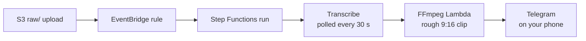

> Reference copy of the build guide, exported 24 Sep 2026. The living doc is the source of truth and tracks progress: https://claude.ai/code/artifact/f66041c7-114a-4c2e-be32-f922f5293e7e
> Checkbox state here means nothing; ask Rehan which step he's on.

## Week 2: Walking skeleton

By Sunday, copying a video into S3 sends a rough 30-second vertical clip to your phone, and the transcript lands in S3. It's crude on purpose, because every later week swaps one box for a smarter one.



**Files this week.** Each step below says exactly what to do with each one.

| File | What you do | Where in this week |
| --- | --- | --- |
| `services/make_clip/Dockerfile` | Create | Build the FFmpeg Lambda, step 3 |
| `services/make_clip/app.py` | Create | Build the FFmpeg Lambda, step 4 |
| `services/notify/app.py` | Create | Build the notify Lambda |
| `infra/infra/pipeline_stack.py` | Create | Wire it together, step 2 |
| `infra/app.py` | Replace the week 1 version | Wire it together, step 3 |

### Set up the Telegram bot (30 minutes)

Your pipeline talks to you through a Telegram bot. This week it sends clips to your phone; from week 4 it also brings Approve and Reject buttons.

- [ ] **1. Create the bot.** **Telegram**, on your phone or computer: open a chat with **@BotFather** (the one with the blue tick) and send `/newbot`. Answer its two questions: a display name, such as `Clip Agent`, and a username ending in `bot`, such as `rehan_clips_bot`. It replies with a token that looks like `123456789:AAH…`. Treat the token like a password and keep it out of code, commits and chats.
- [ ] **2. Find your chat ID.** **Telegram:** send your new bot any message, such as `hi`. Then, in a **browser**, open this address with your token in place of `YOUR_BOT_TOKEN`, keeping the word `bot` in front of it:

```text
https://api.telegram.org/botYOUR_BOT_TOKEN/getUpdates
```

Find `"chat":{"id":` followed by a number, such as `"chat":{"id":987654321`. That number is your chat ID. If the page shows `"result":[]`, send the bot another message and reload.

- [ ] **3. Store both in Secrets Manager.** **Console:** Secrets Manager → **Store a new secret** → **Other type of secret**. Under **Key/value pairs**, add two rows with the keys typed exactly like this: `token` with your bot token, and `chat_id` with your chat ID. Leave the encryption key as it is → **Next** → secret name `clip/telegram` → **Next** → **Next** → **Store**. It costs $0.40 a month. To check it, open `clip/telegram` and click **Retrieve secret value**: both keys should be there.

### Build the FFmpeg Lambda (about 3 hours)

This Lambda cuts a fixed 30-second vertical clip from one minute into the video. It runs as a container image, which is how Lambda runs code that needs an extra program like FFmpeg.

- [ ] **1. Get a test video.** Find a 5–10 minute landscape video, ideally a podcast episode from one of your campaigns. **Terminal:** make a folder for test videos and copy the video in as `ep1.mp4`. Git ignores `.mp4` files, so videos never get committed. On Windows, where the video is probably in your Windows Downloads folder:

```bash
mkdir -p ~/clip-agent/samples
cp /mnt/c/Users/YOUR_WINDOWS_USER/Downloads/YOUR_VIDEO.mp4 ~/clip-agent/samples/ep1.mp4
```

On a Mac:

```bash
mkdir -p ~/clip-agent/samples
cp ~/Downloads/YOUR_VIDEO.mp4 ~/clip-agent/samples/ep1.mp4
```

If the video's name has spaces, put quotes around its path.

- [ ] **2. Try the cut on your laptop.** **Terminal:**

```bash
cd ~/clip-agent/samples
ffmpeg -ss 60 -i ep1.mp4 -t 30 -vf "crop=ih*9/16:ih,scale=540:960" -c:v libx264 -preset veryfast -crf 28 -c:a aac -b:a 96k -movflags +faststart rough.mp4
```

This is the same command the Lambda runs. It skips one minute in (`-ss 60`), keeps 30 seconds (`-t 30`), crops the middle of the frame to 9:16 and scales it to 540×960. After a few seconds you have `rough.mp4`. Open it to check: on Windows, `explorer.exe .` opens the folder; on a Mac, `open rough.mp4` plays it.

- [ ] **3. Create the Dockerfile.** Its folder is new, so make that first. **Terminal:**

```bash
cd ~/clip-agent
mkdir -p services/make_clip
code services/make_clip/Dockerfile
```

Paste this box and save. The file is named exactly `Dockerfile`, with no extension:

```dockerfile
# services/make_clip/Dockerfile
FROM mwader/static-ffmpeg:9.0 AS ffmpeg
FROM public.ecr.aws/lambda/python:3.12
COPY --from=ffmpeg /ffmpeg /ffprobe /usr/local/bin/
COPY app.py ${LAMBDA_TASK_ROOT}/
CMD ["app.handler"]
```

It copies a static FFmpeg build (it includes libx264, and libass for captions later) into AWS's Python Lambda image ([static-ffmpeg](https://hub.docker.com/r/mwader/static-ffmpeg)). `CMD` tells Lambda to call the `handler` function in `app.py`.

- [ ] **4. Create the function's code** in the same folder. **Terminal:** `code services/make_clip/app.py`, then paste this box and save:

```python
# services/make_clip/app.py
import subprocess

import boto3

s3 = boto3.client("s3")


def handler(event, context):
    bucket, key, video_id = event["bucket"], event["key"], event["video_id"]
    # FFmpeg reads straight from S3 over HTTPS, so the full video never downloads
    src = s3.generate_presigned_url(
        "get_object", Params={"Bucket": bucket, "Key": key}, ExpiresIn=3600
    )
    out = f"/tmp/{video_id}.mp4"
    subprocess.run(
        [
            "ffmpeg", "-y", "-ss", "60", "-i", src, "-t", "30",
            "-vf", "crop=ih*9/16:ih,scale=540:960",  # centre crop to 9:16
            "-c:v", "libx264", "-preset", "veryfast", "-crf", "28",
            "-c:a", "aac", "-b:a", "96k", "-movflags", "+faststart", out,
        ],
        check=True,
    )
    preview_key = f"previews/{video_id}/rough.mp4"
    s3.upload_file(out, bucket, preview_key, ExtraArgs={"ContentType": "video/mp4"})  # Telegram checks the file type
    return {"preview_key": preview_key}
```

Step Functions calls `handler` with the bucket, the video's key and the run's ID. FFmpeg reads the video straight from S3 through a temporary signed link, so the full file never downloads, and writes the clip to `/tmp`, the only folder a Lambda can write to. The code then uploads it to `previews/<run ID>/rough.mp4`, labelled `video/mp4`, because Telegram only accepts a video link served with that type.

### Build the notify Lambda (1 hour)

This one sends the clip to your phone. It only needs Python's standard library and boto3, which Lambda already includes, so it deploys as a plain zip with no Docker.

- [ ] **1. Create `services/notify/app.py`.** Its folder is new too. **Terminal:**

```bash
cd ~/clip-agent
mkdir -p services/notify
code services/notify/app.py
```

Paste this box and save:

```python
# services/notify/app.py
import json
import os
import urllib.request

import boto3

s3 = boto3.client("s3")
secrets = boto3.client("secretsmanager")
_cfg = None


def cfg():
    global _cfg
    if _cfg is None:
        raw = secrets.get_secret_value(SecretId=os.environ["SECRET_ID"])["SecretString"]
        _cfg = json.loads(raw)
    return _cfg


def telegram(method, payload):
    req = urllib.request.Request(
        f"https://api.telegram.org/bot{cfg()['token']}/{method}",
        data=json.dumps(payload).encode(),
        headers={"Content-Type": "application/json"},
    )
    with urllib.request.urlopen(req, timeout=20) as resp:
        return json.loads(resp.read())


def handler(event, context):
    url = s3.generate_presigned_url(
        "get_object",
        Params={"Bucket": os.environ["BUCKET"], "Key": event["preview_key"]},
        ExpiresIn=3600,
    )
    telegram("sendVideo", {
        "chat_id": cfg()["chat_id"],
        "video": url,
        "caption": event.get("text", ""),
        "supports_streaming": True,
    })
    return {"ok": True}
```

It reads your token and chat ID from the `clip/telegram` secret the first time it runs and keeps them in memory. Then it makes a temporary link to the preview in S3 and asks Telegram to send that video to your chat. Telegram fetches the video from the link itself, which works for files up to about 20 MB; low-res previews stay well under that.

### Wire it together with Step Functions (about 5 hours)

The pipeline stack creates both Lambdas, a Step Functions state machine that runs the steps in order, and an EventBridge rule that starts it whenever a video lands under `raw/`.

- [ ] **1. Check your laptop's processor.** **Terminal:** run `uname -m`. `x86_64` means Intel or AMD, like most Windows laptops; `arm64` or `aarch64` means ARM, like Apple Silicon Macs. Your Lambdas are built for the same kind, so Docker doesn't have to emulate the other.
- [ ] **2. Create `infra/infra/pipeline_stack.py`.** **Terminal**, from `~/clip-agent`: `code infra/infra/pipeline_stack.py`. Paste this box. If step 1 printed `arm64` or `aarch64`, change `X86_64` to `ARM_64` and `LINUX_AMD64` to `LINUX_ARM64` on lines 15 and 16. Then save.

```python
# infra/infra/pipeline_stack.py
from aws_cdk import (
    Stack, Duration,
    aws_ecr_assets as ecr_assets,
    aws_events as events,
    aws_events_targets as targets,
    aws_lambda as lambda_,
    aws_secretsmanager as sm,
    aws_stepfunctions as sfn,
    aws_stepfunctions_tasks as tasks,
)
from constructs import Construct

# Match your laptop (run `uname -m`): x86_64 -> X86_64 and LINUX_AMD64; arm64 or aarch64 -> ARM_64 and LINUX_ARM64
ARCH = lambda_.Architecture.X86_64
PLATFORM = ecr_assets.Platform.LINUX_AMD64


class PipelineStack(Stack):
    def __init__(self, scope: Construct, construct_id: str, *, media, table, **kwargs) -> None:
        super().__init__(scope, construct_id, **kwargs)

        telegram = sm.Secret.from_secret_name_v2(self, "Telegram", "clip/telegram")

        make_clip_fn = lambda_.DockerImageFunction(
            self, "MakeClipFn",
            code=lambda_.DockerImageCode.from_image_asset("../services/make_clip", platform=PLATFORM),
            architecture=ARCH,
            memory_size=3008,
            timeout=Duration.minutes(5),
        )
        media.grant_read_write(make_clip_fn)

        notify_fn = lambda_.Function(
            self, "NotifyFn",
            runtime=lambda_.Runtime.PYTHON_3_12,
            architecture=ARCH,
            handler="app.handler",
            code=lambda_.Code.from_asset("../services/notify"),
            timeout=Duration.seconds(30),
            environment={"BUCKET": media.bucket_name, "SECRET_ID": "clip/telegram"},
        )
        media.grant_read(notify_fn)
        telegram.grant_read(notify_fn)

        video_id = sfn.JsonPath.string_at("$$.Execution.Name")

        start_transcribe = tasks.CallAwsService(
            self, "StartTranscription",
            service="transcribe",
            action="startTranscriptionJob",
            iam_resources=["*"],
            parameters={
                "TranscriptionJobName": video_id,
                "LanguageCode": "en-US",
                "Media": {"MediaFileUri": sfn.JsonPath.format(
                    "s3://{}/{}",
                    sfn.JsonPath.string_at("$.detail.bucket.name"),
                    sfn.JsonPath.string_at("$.detail.object.key"),
                )},
                "OutputBucketName": media.bucket_name,
                "OutputKey": sfn.JsonPath.format("transcripts/{}/", video_id),
                "Settings": {"ShowSpeakerLabels": True, "MaxSpeakerLabels": 4},
                "Subtitles": {"Formats": ["srt"]},
            },
            result_path=sfn.JsonPath.DISCARD,
        )
        wait = sfn.Wait(self, "Wait30s", time=sfn.WaitTime.duration(Duration.seconds(30)))
        get_transcribe = tasks.CallAwsService(
            self, "GetTranscription",
            service="transcribe",
            action="getTranscriptionJob",
            iam_resources=["*"],
            parameters={"TranscriptionJobName": video_id},
            result_selector={"status": sfn.JsonPath.string_at("$.TranscriptionJob.TranscriptionJobStatus")},
            result_path="$.transcript",
        )
        make_clip = tasks.LambdaInvoke(
            self, "MakeRoughClip",
            lambda_function=make_clip_fn,
            payload=sfn.TaskInput.from_object({
                "bucket": sfn.JsonPath.string_at("$.detail.bucket.name"),
                "key": sfn.JsonPath.string_at("$.detail.object.key"),
                "video_id": video_id,
            }),
            result_selector={"preview_key": sfn.JsonPath.string_at("$.Payload.preview_key")},
            result_path="$.clip",
        )
        send = tasks.LambdaInvoke(
            self, "SendToPhone",
            lambda_function=notify_fn,
            payload=sfn.TaskInput.from_object({
                "preview_key": sfn.JsonPath.string_at("$.clip.preview_key"),
                "text": "Rough clip ready",
            }),
            result_path=sfn.JsonPath.DISCARD,
        )

        definition = start_transcribe.next(wait).next(get_transcribe).next(
            sfn.Choice(self, "TranscriptReady?")
            .when(sfn.Condition.string_equals("$.transcript.status", "COMPLETED"), make_clip.next(send))
            .when(sfn.Condition.string_equals("$.transcript.status", "FAILED"), sfn.Fail(self, "TranscriptionFailed"))
            .otherwise(wait)
        )

        machine = sfn.StateMachine(
            self, "Pipeline",
            definition_body=sfn.DefinitionBody.from_chainable(definition),
            timeout=Duration.hours(2),
        )
        media.grant_read_write(machine)  # Transcribe reads and writes S3 as this role

        events.Rule(
            self, "OnRawUpload",
            event_pattern=events.EventPattern(
                source=["aws.s3"],
                detail_type=["Object Created"],
                detail={
                    "bucket": {"name": [media.bucket_name]},
                    "object": {"key": [{"prefix": "raw/"}]},
                },
            ),
            targets=[targets.SfnStateMachine(machine)],
        )
```

Read it top to bottom. First come the two Lambdas and their permissions: `grant_read_write` and the other `grant_` calls write the IAM policies for you. Then the steps: `StartTranscription` starts a Transcribe job named after the run, `Wait30s` and `GetTranscription` check it every 30 seconds, and the `TranscriptReady?` choice loops back, fails, or moves on to `MakeRoughClip` and `SendToPhone`. At the bottom, the `events.Rule` starts a run for every new file under `raw/`.

- [ ] **3. Replace `infra/app.py`** so it includes the new stack. **Terminal:** `code infra/app.py`, then select everything with Ctrl+A (Cmd+A), paste this box and save:

```python
# infra/app.py
import os

import aws_cdk as cdk

from infra.pipeline_stack import PipelineStack
from infra.storage_stack import StorageStack

app = cdk.App()
env = cdk.Environment(account=os.getenv("CDK_DEFAULT_ACCOUNT"), region="us-east-1")

storage = StorageStack(app, "ClipStorage", env=env)
PipelineStack(app, "ClipPipeline", media=storage.media, table=storage.table, env=env)

cdk.Tags.of(app).add("project", "clip-agent")
app.synth()
```

`PipelineStack` receives the bucket and table from `StorageStack`, and CDK links the two stacks for you.

- [ ] **4. Start Docker.** Open Docker Desktop and wait until it shows **Engine running**; CDK uses it to build the FFmpeg image. **Terminal:** `docker run hello-world` should print `Hello from Docker!`. On Windows, if Ubuntu says `docker: command not found`, open Docker Desktop's **Settings → Resources → WSL integration**, switch on your Ubuntu, click **Apply**, and open a new terminal.
- [ ] **5. Check and deploy.** **Terminal:**

```bash
cd ~/clip-agent/infra
source .venv/bin/activate
cdk synth
cdk deploy --all
```

`cdk synth` should end with `Supply a stack id (ClipStorage, ClipPipeline) to display its template`, which means both stacks are fine. The first deploy builds and uploads the FFmpeg image, so give it 5–10 minutes, and type `y` when it asks about the IAM changes. It ends with `✅  ClipPipeline`.

- [ ] **6. Look at what you built.** **Console:** Step Functions → State machines → the one whose name starts with `Pipeline`. Its **Definition** tab draws your steps as a graph. Lambda → Functions lists `ClipPipeline-MakeClipFn…` and `ClipPipeline-NotifyFn…`.

### Test end to end (1 hour)

- [ ] **1. Upload the test video.** **Terminal:**

```bash
BUCKET=$(aws s3 ls | grep -o 'clipstorage-media[^ ]*')
echo $BUCKET
aws s3 cp ~/clip-agent/samples/ep1.mp4 s3://$BUCKET/raw/test/ep1.mp4
```

The first line finds your media bucket's name and keeps it in `$BUCKET`, and `echo` shows it (`clipstorage-media…`). If it's blank, sign in again with `aws sso login --profile clip`. Keep uploaded file names to letters, numbers and dashes, because odd characters in S3 keys break the Transcribe step.

- [ ] **2. Watch it run.** **Console:** Step Functions → State machines → `Pipeline…` → the newest execution. The graph colours each step as it goes: blue while running, green when done, red if it failed. Transcription takes a few minutes, so the `Wait30s` and `GetTranscription` loop repeats. If a step turns red, click it and read its **Error** and **Cause**.
- [ ] **3. Get the clip.** When `SendToPhone` turns green, Telegram shows "Rough clip ready" with your clip.
- [ ] **4. Check the transcript.** **Terminal:** `aws s3 ls s3://$BUCKET/transcripts/ --recursive` lists a `.json` and a `.srt` file in a folder named after the run. In a new terminal, run the `BUCKET=` line again first.
- [ ] **5. Save your work and record the Sunday demo.** **Terminal:**

```bash
cd ~/clip-agent
git add .
git commit -m "Week 2: walking skeleton"
git push
```

Keep test videos short while developing. Transcribe charges $0.006 a minute, so a 10-minute test costs 6 cents.

**Done when:** a video you upload produces a rough vertical clip on your phone within about 10 minutes, and the transcript files sit in S3.

**Escape hatch:** if Docker won't build the image, put a static FFmpeg binary in `services/make_clip/bin/`, switch to a zip-based `lambda_.Function`, and call `bin/ffmpeg`. Zip functions allow 250 MB unzipped, which fits FFmpeg.
