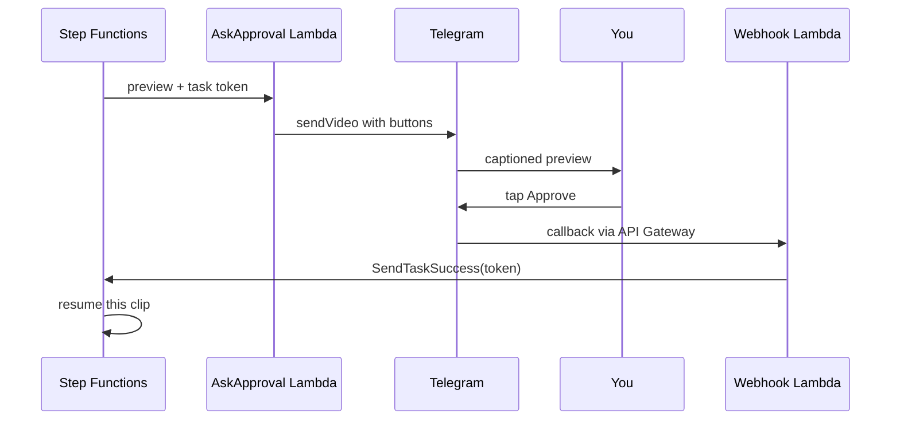

> Reference copy of the build guide, exported 24 Sep 2026. The living doc is the source of truth and tracks progress: https://claude.ai/code/artifact/f66041c7-114a-4c2e-be32-f922f5293e7e
> Checkbox state here means nothing; ask Rehan which step he's on.

## Week 4: Captioned previews and phone approvals

By Sunday, every candidate arrives on your phone as a captioned 9:16 preview with Approve and Reject buttons, and each tap resumes the paused Step Functions run. This is the callback pattern, a favourite topic in both the Solutions Architect exam and interviews.



The task token is too long for a Telegram button, so the button carries the clip ID and the token waits in DynamoDB.

**Files this week.** Create and Replace rows are whole files. Change rows show only the new lines, and the `#` comments in those boxes say where each part goes; running `/step` with the week and step name in Claude Code places them with you.

| File | What you do | Step |
| --- | --- | --- |
| `services/render_preview/fonts/` | Download a caption font into this new folder | Captioned previews |
| `services/render_preview/captions.py` | Create | Captioned previews |
| `services/render_preview/app.py` | Create | Captioned previews |
| `services/render_preview/Dockerfile` | Create | Captioned previews |
| `services/notify/ask.py` | Create | Approve from your phone |
| `services/notify/webhook.py` | Create | Approve from your phone |
| `infra/infra/pipeline_stack.py` | Change: new imports, new functions before `video_id = ...`, replacement tasks and a longer timeout, each headed by a `#` comment | Approve from your phone |

### Captioned previews (about 4 hours)

- [ ] Download a bold caption font with an open licence, such as Anton from Google Fonts, into `services/render_preview/fonts/`. Lambda images ship without fonts, so FFmpeg needs this folder.
- [ ] Create the three files below. `captions.py` turns word timings into an ASS subtitle file, three words at a time.

```python
# services/render_preview/captions.py
HEADER = """[Script Info]
ScriptType: v4.00+
PlayResX: 1080
PlayResY: 1920

[V4+ Styles]
Format: Name, Fontname, Fontsize, PrimaryColour, SecondaryColour, OutlineColour, BackColour, Bold, Italic, Underline, StrikeOut, ScaleX, ScaleY, Spacing, Angle, BorderStyle, Outline, Shadow, Alignment, MarginL, MarginR, MarginV, Encoding
Style: Caption,Anton,110,&H00FFFFFF,&H00FFFFFF,&H00000000,&H64000000,0,0,0,0,100,100,0,0,1,7,2,2,80,80,560,1

[Events]
Format: Layer, Start, End, Style, Name, MarginL, MarginR, MarginV, Effect, Text
"""


def ass_time(t):
    h, rem = divmod(max(t, 0), 3600)
    m, s = divmod(rem, 60)
    return f"{int(h)}:{int(m):02d}:{s:05.2f}"


def build_ass(words, start, end, per_line=3):
    """Three words at a time, timed to speech, relative to the clip start."""
    clip = [w for w in words if start <= w["s"] < end]
    events = []
    for i in range(0, len(clip), per_line):
        group = clip[i:i + per_line]
        text = " ".join(w["w"] for w in group).upper().replace("{", "(").replace("}", ")")
        a, b = group[0]["s"] - start, min(group[-1]["e"], end) - start
        events.append(f"Dialogue: 0,{ass_time(a)},{ass_time(b)},Caption,,0,0,0,,{text}")
    return HEADER + "\n".join(events) + "\n"
```

```python
# services/render_preview/app.py
import json
import os
import subprocess

import boto3

from captions import build_ass

s3 = boto3.client("s3")
FONTS = os.path.join(os.path.dirname(os.path.abspath(__file__)), "fonts")


def handler(event, context):
    bucket, key, video_id = event["bucket"], event["key"], event["video_id"]
    clip_id, c = event["clip_id"], event["candidate"]
    start, end = float(c["start"]), float(c["end"])

    words = json.loads(s3.get_object(Bucket=bucket, Key=f"transcripts/{video_id}/words.json")["Body"].read())
    ass_path = f"/tmp/{clip_id}.ass"
    with open(ass_path, "w") as f:
        f.write(build_ass(words, start, end))

    src = s3.generate_presigned_url("get_object", Params={"Bucket": bucket, "Key": key}, ExpiresIn=3600)
    out = f"/tmp/{clip_id}.mp4"
    vf = f"crop=ih*9/16:ih,scale=540:960,subtitles={ass_path}:fontsdir={FONTS}"
    subprocess.run(
        ["ffmpeg", "-y", "-ss", f"{start:.2f}", "-i", src, "-t", f"{end - start:.2f}",
         "-vf", vf, "-c:v", "libx264", "-preset", "veryfast", "-crf", "28",
         "-c:a", "aac", "-b:a", "96k", "-movflags", "+faststart", out],
        check=True,
    )
    preview_key = f"previews/{video_id}/{clip_id}.mp4"
    s3.upload_file(out, bucket, preview_key, ExtraArgs={"ContentType": "video/mp4"})  # Telegram checks the file type
    return {"preview_key": preview_key}
```

```dockerfile
# services/render_preview/Dockerfile
FROM mwader/static-ffmpeg:9.0 AS ffmpeg
FROM public.ecr.aws/lambda/python:3.12
COPY --from=ffmpeg /ffmpeg /ffprobe /usr/local/bin/
COPY fonts/ ${LAMBDA_TASK_ROOT}/fonts/
COPY app.py captions.py ${LAMBDA_TASK_ROOT}/
CMD ["app.handler"]
```

### Approve from your phone (about 5 hours)

- [ ] Generate a webhook secret and add it to the Telegram secret. Telegram will send it in a header with every update, which proves a request came from Telegram.

```bash
python3 -c "import secrets; print(secrets.token_urlsafe(32))"
aws secretsmanager put-secret-value --secret-id clip/telegram \
  --secret-string '{"token":"...","chat_id":"...","webhook_secret":"THE_VALUE_ABOVE"}'
```

- [ ] Add `services/notify/ask.py`. It stores the task token, then sends the preview with buttons:

```python
# services/notify/ask.py
import json
import os

import boto3

from app import cfg, s3, telegram

table = boto3.resource("dynamodb").Table(os.environ["TABLE"])


def handler(event, context):
    """Runs with a task token: the Step Functions run waits until webhook.py answers."""
    clip_id, c = event["clip_id"], event["candidate"]
    table.put_item(Item={
        "pk": f"CLIP#{clip_id}", "sk": "META",
        "token": event["token"], "status": "PENDING",
        "candidate": json.dumps(c), "preview_key": event["preview_key"],
    })
    url = s3.generate_presigned_url(
        "get_object", Params={"Bucket": os.environ["BUCKET"], "Key": event["preview_key"]}, ExpiresIn=3600
    )
    keyboard = {"inline_keyboard": [
        [{"text": "Approve", "callback_data": f"a|ok|{clip_id}"}],
        [{"text": "Weak hook", "callback_data": f"r|hook|{clip_id}"},
         {"text": "Needs context", "callback_data": f"r|context|{clip_id}"},
         {"text": "Other", "callback_data": f"r|other|{clip_id}"}],
    ]}
    telegram("sendVideo", {
        "chat_id": cfg()["chat_id"],
        "video": url,
        "supports_streaming": True,
        "caption": f"{c['title']}\nScore {c['score']}/10\n\n{c['rationale'][:600]}",
        "reply_markup": keyboard,
    })
    return {"sent": clip_id}
```

- [ ] Add `services/notify/webhook.py`. It checks the secret header, accepts taps only from your own chat, and uses a conditional write so a double tap can't decide twice:

```python
# services/notify/webhook.py
import json
import os

import boto3

from app import cfg, telegram

sfn = boto3.client("stepfunctions")
table = boto3.resource("dynamodb").Table(os.environ["TABLE"])


def handler(event, context):
    headers = {k.lower(): v for k, v in (event.get("headers") or {}).items()}
    if headers.get("x-telegram-bot-api-secret-token") != cfg()["webhook_secret"]:
        return {"statusCode": 403, "body": "forbidden"}  # not from Telegram
    update = json.loads(event.get("body") or "{}")
    query = update.get("callback_query")
    if not query or str(query["from"]["id"]) != str(cfg()["chat_id"]):
        return {"statusCode": 200, "body": "ignored"}  # only you can approve

    action, reason, clip_id = query["data"].split("|", 2)
    approved = action == "a"
    try:
        item = table.update_item(
            Key={"pk": f"CLIP#{clip_id}", "sk": "META"},
            UpdateExpression="SET #s = :s, #r = :r",
            ConditionExpression="#s = :pending",  # a second tap can't decide twice
            ExpressionAttributeNames={"#s": "status", "#r": "reason"},
            ExpressionAttributeValues={
                ":s": "APPROVED" if approved else "REJECTED", ":r": reason, ":pending": "PENDING",
            },
            ReturnValues="ALL_NEW",
        )["Attributes"]
    except table.meta.client.exceptions.ConditionalCheckFailedException:
        note = "Already decided"
    else:
        sfn.send_task_success(
            taskToken=item["token"], output=json.dumps({"approved": approved, "reason": reason})
        )
        note = "Approved" if approved else f"Rejected ({reason})"
    telegram("answerCallbackQuery", {"callback_query_id": query["id"], "text": note})
    return {"statusCode": 200, "body": "ok"}
```

- [ ] Update `pipeline_stack.py`. The Map state replaces last week's single clip, and each candidate flows through render, ask and decide on its own:

```python
# Imports: add CfnOutput to the aws_cdk import, plus
#   aws_apigatewayv2 as apigw, aws_apigatewayv2_integrations as integrations

# New functions and the webhook API, before `video_id = ...`
        preview_fn = lambda_.DockerImageFunction(
            self, "RenderPreviewFn",
            code=lambda_.DockerImageCode.from_image_asset("../services/render_preview", platform=PLATFORM),
            architecture=ARCH,
            memory_size=3008,
            timeout=Duration.minutes(5),
        )
        media.grant_read_write(preview_fn)

        telegram_env = {"BUCKET": media.bucket_name, "SECRET_ID": "clip/telegram", "TABLE": table.table_name}
        ask_fn = lambda_.Function(
            self, "AskApprovalFn",
            runtime=lambda_.Runtime.PYTHON_3_12,
            architecture=ARCH,
            handler="ask.handler",
            code=lambda_.Code.from_asset("../services/notify"),
            timeout=Duration.seconds(30),
            environment=telegram_env,
        )
        webhook_fn = lambda_.Function(
            self, "TelegramWebhookFn",
            runtime=lambda_.Runtime.PYTHON_3_12,
            architecture=ARCH,
            handler="webhook.handler",
            code=lambda_.Code.from_asset("../services/notify"),
            timeout=Duration.seconds(30),
            environment=telegram_env,
        )
        for fn in (ask_fn, webhook_fn):
            telegram.grant_read(fn)
            table.grant_read_write_data(fn)
        media.grant_read(ask_fn)

        api = apigw.HttpApi(self, "TelegramApi")
        api.add_routes(
            path="/telegram",
            methods=[apigw.HttpMethod.POST],
            integration=integrations.HttpLambdaIntegration("TelegramIntegration", webhook_fn),
        )
        CfnOutput(self, "WebhookUrl", value=f"{api.url}telegram")

# Replace the MakeRoughClip and SendToPhone tasks with:
        render_preview = tasks.LambdaInvoke(
            self, "RenderPreview",
            lambda_function=preview_fn,
            payload=sfn.TaskInput.from_object({
                "bucket": sfn.JsonPath.string_at("$.bucket"),
                "key": sfn.JsonPath.string_at("$.key"),
                "video_id": sfn.JsonPath.string_at("$.video_id"),
                "clip_id": sfn.JsonPath.string_at("$.clip_id"),
                "candidate": sfn.JsonPath.object_at("$.candidate"),
            }),
            result_selector={"preview_key": sfn.JsonPath.string_at("$.Payload.preview_key")},
            result_path="$.preview",
        )
        ask = tasks.LambdaInvoke(
            self, "AskApproval",
            lambda_function=ask_fn,
            integration_pattern=sfn.IntegrationPattern.WAIT_FOR_TASK_TOKEN,
            payload=sfn.TaskInput.from_object({
                "token": sfn.JsonPath.task_token,
                "clip_id": sfn.JsonPath.string_at("$.clip_id"),
                "candidate": sfn.JsonPath.object_at("$.candidate"),
                "preview_key": sfn.JsonPath.string_at("$.preview.preview_key"),
            }),
            task_timeout=sfn.Timeout.duration(Duration.hours(48)),
            result_path="$.decision",
        )
        ask.add_catch(sfn.Pass(self, "NoAnswerIn48h"), errors=["States.Timeout"])
        approved = sfn.Pass(self, "Approved")  # week 5 replaces this with render, check, publish
        decide = (
            sfn.Choice(self, "Approved?")
            .when(sfn.Condition.boolean_equals("$.decision.approved", True), approved)
            .otherwise(sfn.Succeed(self, "Rejected"))
        )

        each_candidate = sfn.Map(
            self, "EachCandidate",
            items_path="$.moments.candidates",
            max_concurrency=5,  # at most 5 clips waiting on your phone at once
            item_selector={
                "candidate": sfn.JsonPath.object_at("$$.Map.Item.Value"),
                "clip_id": sfn.JsonPath.format("{}-{}", video_id, sfn.JsonPath.string_at("$$.Map.Item.Index")),
                "video_id": video_id,
                "bucket": sfn.JsonPath.string_at("$.detail.bucket.name"),
                "key": sfn.JsonPath.string_at("$.detail.object.key"),
            },
            result_path=sfn.JsonPath.DISCARD,
        )
        each_candidate.item_processor(render_preview.next(ask).next(decide))

# The COMPLETED branch becomes prepare.next(find).next(each_candidate)
# On the StateMachine, raise the timeout to Duration.days(3), and after it add:
        machine.grant_task_response(webhook_fn)  # lets the webhook resume waiting runs
```

- [ ] Run `cdk deploy ClipPipeline` and copy the `WebhookUrl` output.
- [ ] Register the webhook with Telegram:

```bash
curl "https://api.telegram.org/bot$TOKEN/setWebhook" \
  -d "url=$WEBHOOK_URL" -d "secret_token=$WEBHOOK_SECRET"
```

### Test it (1 hour)

- [ ] Upload a video. Up to five previews arrive at once, and the next one comes as you decide each.
- [ ] Approve one and reject one, then watch both branches in the Step Functions graph.
- [ ] Tap the same button twice; the second tap should say "Already decided".
- [ ] Call the webhook URL with curl and no secret header; it should return 403.

**Done when:** tapping Approve moves that clip to the green Approved state, and every rejection stores its reason in DynamoDB.

**Escape hatch:** if the webhook fights you, approve from the terminal while you debug. Copy the token from the clip's DynamoDB item, then run `aws stepfunctions send-task-success --task-token "$TOKEN" --task-output '{"approved":true,"reason":"ok"}'`.
